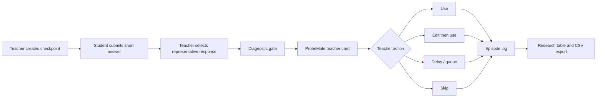

# ProbeMate Web


ProbeMate Web 是一个面向课堂短答诊断的教师端研究原型。它帮助教师在学生提交短答之后，先经过一个可审计的 diagnostic gate，再决定下一句课堂追问、是否采用系统建议、是否改写建议、是否稍后处理，或是否跳过建议。

当前版本为 `v1.0.0`。本仓库只包含 Web 原型相关代码：FastAPI 后端、Next.js 前端、共享说明、测试和本地开发配置。

## 核心目标

ProbeMate 不是直接给学生贴误概念标签的系统。它的核心目标是支持教师在课堂中做更稳健的下一步决策：

- 收集全班短答，保留学生原话和匿名编号。
- 允许教师选择或录入一条代表性回答。
- 对代表回答运行 Hold / Ask / Probe 诊断闸门。
- 展示候选解释、证据缺口、追问建议和安全提示。
- 记录教师最终动作，包括采用、编辑后采用、稍后处理和跳过。
- 导出研究日志，用于后续 Study 2/3/4 的 episode 级分析。

## 功能概览

### 教师端

- 创建课堂 checkpoint。
- 使用内置物理课堂模板快速建题。
- 设置教学阶段、当前活动和展示策略。
- 复制学生入口链接。
- 关闭或重新开启提交。
- 查看学生短答列表。
- 选择代表回答，或手动录入教师代表回答。
- 运行诊断闸门并查看 ProbeMate 卡片。
- 记录教师操作和课堂反馈。
- 维护 Hold / Delay 待处理队列。

### 学生端

- 通过 checkpoint code 进入短答页面。
- 填写匿名编号。
- 提交最多 200 字短答。
- 自报把握程度：不确定、把握较低、有些把握、很有把握。
- 在 checkpoint 开放期间修改既有回答。
- checkpoint 关闭后阻止继续提交。

### 研究后台

- 查看 episode log。
- 按系统 move、回答来源、教师动作、队列状态筛选。
- 支持分页。
- 导出当前筛选条件下的 CSV。
- 默认对关键 ID 字段去标识化。
- 展示数据字典，说明字段含义、来源和取值范围。

## 技术栈

| 层 | 技术 | 说明 |
| --- | --- | --- |
| Frontend | Next.js 16, React 19, TypeScript | App Router 单页原型 |
| UI | shadcn/ui 风格组件, Base UI, Tailwind CSS, Phosphor Icons | 稳定组件语义和较轻的视觉系统 |
| Backend | FastAPI, Pydantic | REST API 和数据建模 |
| Runtime data | JSON file store | 本地开发默认使用文件存储 |
| Testing | pytest, ESLint, Next build, Playwright script | API 单测、前端静态检查、构建检查、端到端流程脚本 |

## 目录结构

```text
web-app/
  api/
    app/
      api/routes.py              # FastAPI routes
      schemas/models.py          # Pydantic schemas and enums
      services/store.py          # JSON-backed local store
      services/pipeline.py       # diagnostic gate mock pipeline
      services/export.py         # research CSV export
      services/data_dictionary.py
      services/templates.py      # checkpoint templates
    tests/                       # API tests
    pyproject.toml
    uv.lock
  frontend/
    app/
      page.tsx
      teacher/page.tsx
      teacher/checkpoints/[id]/page.tsx
      s/[checkpointCode]/page.tsx
      research/page.tsx
    components/ui/               # shadcn/ui-style primitives
    lib/api.ts                   # frontend API client
    lib/types.ts                 # shared TypeScript types
    scripts/devtools-flow-test.cjs
    package.json
    package-lock.json
  shared/
    README.md
  .env.example
  README.md
  方案.md
```

## 系统流程



## 环境要求

- Node.js 20+ 或 22+
- npm 10+
- Python 3.13+
- uv
- PowerShell、Windows Terminal 或兼容 shell

如果没有安装 `uv`，可以参考：

```powershell
pip install uv
```

## 环境变量

复制 `.env.example` 后按需调整：

```powershell
Copy-Item .env.example .env
```

默认内容：

```env
NEXT_PUBLIC_API_BASE_URL=http://127.0.0.1:8000
OPENAI_API_KEY=
SUPABASE_URL=
SUPABASE_ANON_KEY=
SUPABASE_SERVICE_ROLE_KEY=
```

当前 `v1.0.0` 主要使用本地 JSON store 和 mock diagnostic gate。OpenAI 与 Supabase 字段是为后续扩展预留的接口配置。

## 本地启动

### 1. 启动 API

```powershell
cd api
uv run uvicorn app.main:app --reload --host 127.0.0.1 --port 8000
```

API 默认地址：

```text
http://127.0.0.1:8000
```

如果 `8000` 被占用，可以改用 `8001`：

```powershell
cd api
uv run uvicorn app.main:app --reload --host 127.0.0.1 --port 8001
```

此时前端需要设置：

```powershell
$env:NEXT_PUBLIC_API_BASE_URL="http://127.0.0.1:8001"
```

### 2. 启动前端

```powershell
cd frontend
npm install
npm run dev
```

前端默认地址：

```text
http://localhost:3000
```

常用页面：

```text
http://localhost:3000/teacher
http://localhost:3000/research
```

学生入口由教师端 checkpoint 自动生成，格式为：

```text
http://localhost:3000/s/{checkpointCode}
```

## API 说明

### Checkpoint

| Method | Path | 用途 |
| --- | --- | --- |
| GET | `/checkpoints` | 列出 checkpoint |
| POST | `/checkpoints` | 创建 checkpoint |
| GET | `/checkpoints/{checkpoint_id}` | 获取 checkpoint |
| PATCH | `/checkpoints/{checkpoint_id}` | 更新状态、阶段、活动或展示策略 |
| GET | `/checkpoints/code/{code}` | 学生端通过 code 获取 checkpoint |
| GET | `/checkpoint-templates` | 获取课堂模板 |

### Student response

| Method | Path | 用途 |
| --- | --- | --- |
| GET | `/checkpoints/{checkpoint_id}/responses` | 列出短答 |
| POST | `/checkpoints/{checkpoint_id}/responses` | 新建学生短答或教师代表回答 |
| PATCH | `/responses/{response_id}` | 修改短答、把握程度或代表回答状态 |
| POST | `/responses/{response_id}/analyze` | 运行诊断闸门 |
| POST | `/responses/{response_id}/analyze?rerun=true` | 强制重新分析 |

### Teacher action and research

| Method | Path | 用途 |
| --- | --- | --- |
| POST | `/teacher-actions` | 记录教师动作 |
| GET | `/research/episode-logs` | 查询 episode log |
| GET | `/research/episode-logs.csv` | 导出 CSV |
| GET | `/research/data-dictionary` | 获取数据字典 |

## 关键数据模型

### Checkpoint

- `question`：课堂问题。
- `target_concept`：目标概念。
- `lesson_phase`：教学阶段。
- `current_activity`：当前活动。
- `visibility_policy`：展示策略。
- `status`：`open` 或 `closed`。

### StudentResponse

- `anonymous_student_id`：匿名编号。
- `answer_text`：学生短答原文。
- `response_source`：`student_qr`、`teacher_representative` 或 `imported_episode`。
- `confidence_level`：学生自报把握程度。
- `revision`：回答修订版本。
- `is_representative`：是否被设为代表回答。

### TeacherCard

- `gate_decision.move`：`hold`、`ask_for_evidence` 或 `diagnostic_probe`。
- `gate_decision.why_this_move`：系统选择该 move 的理由。
- `gate_decision.teacher_move`：建议教师话术。
- `candidate_output.candidate_explanations`：候选解释和证据缺口。
- `response_revision`：卡片对应的回答版本。

### EpisodeLog

- 连接 checkpoint、response、card、teacher action。
- 保存系统 move、教师动作、决策时间、反馈、队列状态。
- 支持 Study 2/3/4 所需的审计和导出字段。

## CSV 去标识化

`/research/episode-logs.csv` 默认 `deidentify=true`。以下字段会被哈希化：

- `id`
- `checkpoint_id`
- `response_id`
- `card_id`
- `ai_run_id`

如果需要导出原始 ID，可显式使用：

```text
/research/episode-logs.csv?deidentify=false
```

研究数据正式使用前，应先确认伦理审批、数据留存范围和课堂告知流程。

## 测试

### API 单元测试

```powershell
cd api
uv run pytest
```

### 前端静态检查

```powershell
cd frontend
npm run lint
```

### 前端生产构建

```powershell
cd frontend
npm run build
```

### 端到端流程脚本

前后端服务启动后运行：

```powershell
cd frontend
node scripts/devtools-flow-test.cjs
```

脚本覆盖：

- API health check。
- 教师通过模板创建 checkpoint。
- 复制学生入口。
- 学生提交和修改短答。
- checkpoint 关闭与重开。
- 教师选择代表回答并运行分析。
- 四种教师动作：采用、编辑后采用、稍后处理、跳过。
- 研究日志筛选、CSV 去标识化、数据字典校验。
- console error、page error、网络失败和运行时异常检查。

## 本地数据存储

API 默认将开发数据写入：

```text
api/data/dev-store.json
```

该目录被 `.gitignore` 排除，不会提交到仓库。可以通过环境变量改写路径：

```powershell
$env:PROBEMATE_STORE_PATH="D:\tmp\probemate-store.json"
```

## 开发约定

- 前端类型定义集中在 `frontend/lib/types.ts`。
- 前端请求封装集中在 `frontend/lib/api.ts`。
- 后端枚举和响应结构集中在 `api/app/schemas/models.py`。
- API 行为尽量通过 `api/tests` 覆盖。
- UI 组件保持 shadcn/ui 风格，避免页面级逻辑进入基础组件。
- 研究导出字段变更时同步更新 `data_dictionary.py` 和 README。

## 部署建议

### 前端

Next.js 前端可以部署到 Vercel、Netlify 或自托管 Node 环境。部署时设置：

```env
NEXT_PUBLIC_API_BASE_URL=https://your-api.example.com
```

### 后端

FastAPI 后端可以部署到 Render、Fly.io、Railway、Docker、云服务器或校内服务器。生产环境建议替换 JSON store：

- PostgreSQL 或 Supabase 存储 checkpoint、response、teacher action、episode log。
- 对敏感字段执行最小化采集和访问控制。
- 为课堂研究数据设置数据保留周期。
- 将诊断模型调用、prompt 版本、schema 版本持久记录。

## v1.0.0 范围

本版本完成的工程范围：

- 教师端 checkpoint 创建和模板选择。
- 学生端短答提交、修改和把握程度记录。
- 教师代表回答选择。
- Hold / Ask / Probe 诊断卡片。
- 教师动作记录和待处理队列。
- 研究日志筛选、分页、CSV 导出和数据字典。
- 前后端基础测试和端到端流程脚本。

暂未纳入 `v1.0.0` 的范围：

- 多教师账号体系。
- 真实数据库迁移。
- 真实大模型服务接入。
- 班级、课程和学生 roster 管理。
- 正式部署安全策略。
- 伦理审批文档自动化管理。

## 维护命令速查

```powershell
# API
cd api
uv run pytest
uv run uvicorn app.main:app --reload --host 127.0.0.1 --port 8000
```

```powershell
# Frontend
cd frontend
npm install
npm run dev
npm run lint
npm run build
node scripts/devtools-flow-test.cjs
```

## 许可证

当前仓库作为研究原型使用，尚未声明开源许可证。公开发布、二次分发或用于真实课堂研究前，请先补充许可证、伦理说明和数据治理文档。
