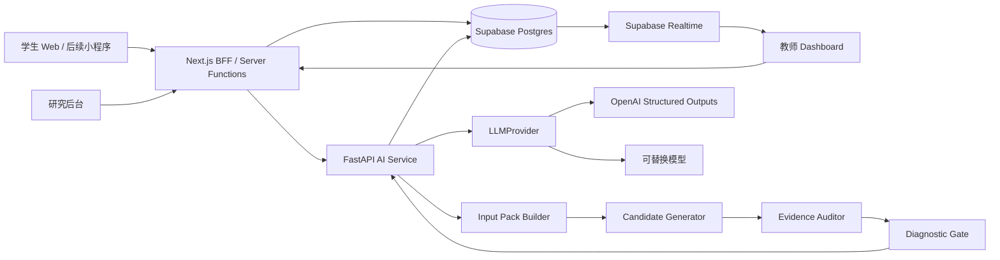

# ProbeMate 软件工程开发方案

面向高中物理课堂的教师端诊断闸门系统

## 0. 版本基线

本文档基于当前最新版 `reports/chi方案v13.pdf` 与本目录原始 `web-app/方案.md` 重写，不参考历史旧版方案。v13 已经把论文主线收束为三个层次：

| 层次 | 工程含义 |
| --- | --- |
| DCR, diagnostic commitment regulation | 系统设计原则：AI 先判断介入资格，再影响教师下一句话。 |
| diagnostic gate | 系统实现核心：把学生短答和课堂上下文映射到教师端动作。 |
| Hold / Ask for Evidence / Diagnostic Probe | 唯一对外呈现的三类教师端动作。 |

工程方案必须保持这个收束：候选解释、证据审计、Use/Edit/Delay/Skip、学生可见性、checkpoint 代价只作为内部实现、控件、日志或部署边界，不再写成新的理论框架。

## 1. 项目定位与工程目标

ProbeMate 第一版应实现为一个研究型课堂原型，而不是完整商业化教学平台、自动评分系统、学生端 tutor 或全口语课堂感知系统。

第一版的最稳路线是：

```text
学生短书面回答
  -> 候选解释与证据审计
  -> diagnostic gate
  -> Hold / Ask for Evidence / Diagnostic Probe
  -> 教师端可编辑卡片
  -> 全量研究日志
```

核心工程目标有四个：

1. 在真实或准真实高中物理课堂中采集短书面 checkpoint，不追求全程 ASR。
2. 让系统输出稳定、可复现、可审计的三动作诊断闸门结果。
3. 让教师在低负担界面中使用、改写、延迟或跳过系统建议。
4. 让同一套系统支持 Study 2 专家评价、Study 3 教师 next-turn 实验和 Study 4 早期课堂部署日志。

第一版不承诺：

| 不做 | 原因 |
| --- | --- |
| 完整口语课堂实时转写 | ASR、多说话人、噪声和课堂管理会污染 DCR 验证。 |
| 自动判断某个学生属于某误概念群体 | 标签化风险高，也偏离教师端诊断闸门定位。 |
| 学生端显示 AI 诊断 | 学生端只提交短答，不显示误概念标签。 |
| AI 自动进入全班展示 | 必须由教师确认、改写或延迟。 |
| 长期学习成绩提升主张 | Study 4 是 early deployment evidence，不是学习增益因果实验。 |

## 2. 研究主线到工程需求映射

ProbeMate 是研究仪器，工程功能必须反向服务 v13 的研究问题。

| 研究目标 | 工程能力 | 需要记录的数据 |
| --- | --- | --- |
| Study 0：检验 LLM 单标签诊断局限 | 同一 episode 可运行 naive prompt、candidate-list prompt 和 gate prompt | top-1、top-3、候选覆盖、证据不足识别、原始输出 |
| Study 1：提取教师实践与设计要求 | 支持导入课堂 episode、人工编码三动作、记录 timing rationale | student evidence、teacher move、timing rationale、codebook version |
| Study 2：专家评价输出是否更合适 | 一键生成 Standard LLM、Over-committed、Evidence-only、ProbeMate 四类材料 | episode、condition、输出文本、专家偏好、over/under 标注 |
| Study 3：教师 next-turn 实验 | 在限时 vignette 中呈现 0 或 1 个建议，记录教师最终回应 | teacher final turn、Use/Edit/Delay/Skip、decision time、edit distance |
| Study 4：课堂早期部署 | 课堂 checkpoint、教师处理方式、课后队列、导出脱敏日志 | checkpoint timing、submission rate、cancel reason、student visibility feedback |

工程上只把 Study 2 和 Study 3 作为主结果支持对象；Study 0、Study 1、Study 4 分别作为系统前提、设计来源和部署代价支持。

## 3. 用户角色与使用场景

### 3.1 用户角色

| 角色 | 权限与任务 |
| --- | --- |
| 学生 | 通过二维码进入当前 checkpoint，提交一句短答；不能查看 AI 诊断和聚类标签。 |
| 教师 | 创建课程、发起 checkpoint、查看回答、选择代表回答、查看 ProbeMate 卡片、Use/Edit/Delay/Skip。 |
| 研究者 / 实验管理员 | 配置实验条件、管理 episode portfolio、导出脱敏日志、生成 Study 2/3 材料。 |
| 系统管理员 | 管理学校、班级、用户、模型配置、数据保留策略和审计日志。 |

### 3.2 三种部署模式

三种模式必须共用同一个 diagnostic gate，不增加新的动作类型。

| 模式 | MVP 状态 | 用途 | 输入来源 |
| --- | --- | --- | --- |
| 完整 checkpoint 模式 | 必做 | Study 4 与课堂试点 | 全班学生扫码提交短答，系统聚类或教师选择代表回答。 |
| 教师代表输入模式 | 必做 | 课堂低成本试点、Study 3 材料准备 | 教师手动输入 1-3 条代表性学生回答。 |
| 课后 episode 模式 | 架构预留，Phase 4 实现 | 当实时模式成本过高时转向课后分析 | 教师课后输入或导入课堂中记下的学生话语。 |

### 3.3 典型课堂流程

```text
教师创建 lesson
  -> 创建 checkpoint 并展示二维码
  -> 学生提交短答
  -> dashboard 实时显示提交数和回答列表
  -> 教师选择 1-5 条代表回答或采用系统聚类推荐
  -> 后端生成候选解释和证据审计
  -> diagnostic gate 输出三动作之一
  -> 教师查看卡片并 Use/Edit/Delay/Skip
  -> 系统记录每一步事件
```

## 4. 功能需求

### 4.1 MVP 必做功能

| 模块 | 功能 |
| --- | --- |
| 课程与课堂 | 创建班级、lesson、checkpoint；设置目标概念、教学阶段、当前活动、是否允许匿名展示。 |
| 学生提交 | 二维码访问、匿名 ID、短答输入、提交状态、重复提交限制。 |
| 教师 dashboard | 实时提交数、短答列表、代表回答选择、聚类建议、低打断状态提示。 |
| AI pipeline | input pack 构建、候选解释生成、quote-required evidence audit、diagnostic gate。 |
| 教师卡片 | 固定显示 Move、Why this move、Teacher move、Controls。 |
| 教师操作 | Use、Edit、Delay、Skip；支持最终教师回应输入和建议错误反标记。 |
| 研究后台 | episode portfolio、条件材料生成、日志导出、脱敏导出。 |
| 降级与恢复 | LLM 超时、网络失败、无证据、阶段不合适时自动降级。 |

### 4.2 Phase 2 以后扩展功能

| 功能 | 扩展方式 |
| --- | --- |
| 自动聚类 | 从教师手选代表回答起步，后续接 embedding + k-means/HDBSCAN。 |
| 小程序学生端 | 仅替换学生提交入口，复用后端 API、diagnostic gate 和日志 schema。 |
| 多模型对比 | 通过 `LLMProvider` 接口接 OpenAI、国内模型或本地模型。 |
| 离线材料生成 | 批量生成 Study 2/3 输出条件，不依赖实时课堂。 |
| 个性化教师偏好 | 只基于教师反标记做研究性分析，不在 MVP 中自动改变 gate 规则。 |

## 5. 非功能需求

| 类别 | 要求 |
| --- | --- |
| 延迟 | 单条代表回答从点击分析到卡片返回目标 `< 4.5s`；超时自动返回 Ask for Evidence 模板或 Hold 队列。 |
| 可用性 | 教师卡片必须能在 20-30 秒限时情境中读懂；屏幕上不堆叠复杂解释。 |
| 可复现 | 每次 AI 调用保存 prompt version、schema version、model、temperature、raw output 和 gate decision。 |
| 可扩展 | Study 4 目标规模：6-10 名教师、3-4 周、每节课 1-3 checkpoint、每个 checkpoint 约 30-60 条短答。 |
| 可替换 | LLM、聚类、学生端入口、实时通道都必须是可替换模块。 |
| 可审计 | 所有教师操作、系统建议、降级原因、导出行为写入审计日志。 |
| 数据隔离 | 课堂运行数据、研究导出数据、系统审计数据分表管理。 |
| 隐私 | 默认不存学生真实姓名；研究导出前脱敏；不向学生或全班公开误概念标签。 |

## 6. 技术栈决策

默认技术路线：Web 优先、可扩展、保留小程序适配层。

| 层级 | 选型 | 选择理由 |
| --- | --- | --- |
| 前端 | Next.js App Router + TypeScript | 同一工程承载学生端、教师端和研究后台；App Router 支持现代 React 路由与服务端组件。 |
| UI | Tailwind CSS + shadcn/ui 或同等级组件库 | 快速构建研究原型，保持表单、卡片、表格一致。 |
| AI 服务 | FastAPI + Pydantic | Pydantic schema 适合固定 AI 输入输出；FastAPI 自动生成 OpenAPI 文档，便于前后端并行。 |
| 数据库 | Supabase Postgres | 关系型 schema 更适合研究日志、episode、导出和审计。 |
| 实时同步 | Supabase Realtime | 支持 Broadcast、Presence、Postgres Changes；Postgres Changes 可与 RLS 结合做权限控制。 |
| LLM | OpenAI Structured Outputs 优先，封装 provider | Structured Outputs 比 JSON mode 更适合强 schema 输出；后续可替换为国内模型。 |
| 部署 | Web 前端 + AI 服务分开部署 | 前端可 Vercel/CloudBase 静态托管；AI 服务可 Render/Fly.io/Cloud Run/云托管/Docker。 |
| 中国课堂适配 | CloudBase 或微信小程序作为后续入口 | CloudBase 提供数据库、认证、云函数/云托管和实时订阅，适合小程序试点。 |

不建议 MVP 采用 Next.js 全栈单体承载 AI pipeline。原因是 Study 0-4 需要批量运行、prompt version 管理、离线导出和模型替换；独立 FastAPI 服务更容易测试和扩展。

## 7. 总体架构



### 7.1 分层职责

| 层 | 职责 |
| --- | --- |
| Next.js client | 学生提交、教师 dashboard、研究后台 UI、实时订阅。 |
| Next.js BFF | 鉴权、权限检查、轻量表单提交、调用 FastAPI、写入业务表。 |
| FastAPI AI service | AI 输入构建、LLM 调用、证据审计、diagnostic gate、批量材料生成。 |
| Postgres | 持久化课堂、短答、AI run、gate decision、教师操作、研究日志。 |
| Realtime | 推送 checkpoint 提交数、回答列表更新、AI 卡片状态。 |
| Export worker | 脱敏导出 CSV/JSONL，用于 Study 2/3/4 分析。 |

### 7.2 关键架构原则

1. LLM 不直接决定最终动作。最终动作由 deterministic gate 输出，边界 episode 可配置 LLM judge 辅助，但必须记录原因。
2. 原始学生证据优先于生成解释。没有可引用原话时，不允许输出 Diagnostic Probe。
3. 三动作是对外唯一行动类型。Use/Edit/Delay/Skip 是教师处理建议的控件和日志。
4. 所有 AI 输出必须可复现。保存 schema、prompt、model、输入包、原始输出、审计结果和 gate 结果。
5. 学生端入口可替换。Web、微信小程序、纸条扫描导入都只产生 `student_response`，不改变后端核心。

## 8. 前端设计

### 8.1 路由结构

```text
/s/[checkpointCode]          学生提交页
/teacher/classes             教师班级列表
/teacher/lessons/[lessonId]  课堂 dashboard
/teacher/checkpoints/[id]    checkpoint 详情与卡片
/research/episodes           episode portfolio
/research/experiments        Study 2/3 材料生成
/research/exports            脱敏导出
/admin                       系统配置
```

### 8.2 学生提交页

最小界面：

```text
课堂问题
汽车向前运动，但速度越来越小，它的加速度方向是什么？

你的回答
[ 输入一句话，最多 200 字 ]

[ 提交 ]
```

约束：

- 不显示 AI 诊断、误概念类别、聚类标签。
- 默认使用匿名座位码或随机提交码。
- 可显示用途说明：短答用于帮助教师选择下一步追问，不用于给学生贴标签。
- 支持教师关闭 checkpoint，关闭后学生只能看到“本次提交已结束”。

### 8.3 教师课前设置页

必填字段：

| 字段 | 示例 | 用途 |
| --- | --- | --- |
| lesson title | 匀变速直线运动复习 | 日志与课堂管理 |
| target concept | 加速度方向 | input pack |
| checkpoint question | 汽车向前运动但速度越来越小，它的加速度方向是什么？ | 学生提交与 AI 分析 |
| lesson phase | introduce / practice / review / group_discussion / experiment / wrap_up | diagnostic gate |
| current activity | whole_class / peer_discussion / demo / worksheet / teacher_wrap_up | timing 判断 |
| public visibility | anonymous_only / teacher_only / allow_representative_display | 学生可见性约束 |

### 8.4 教师课堂 dashboard

推荐三栏布局：

| 区域 | 内容 |
| --- | --- |
| 左栏：提交状态 | 当前 checkpoint、提交数、平均字数、缺席/未提交数量、关闭按钮。 |
| 中栏：回答列表 | 原始短答、匿名 ID、时间、教师收藏、系统聚类建议。 |
| 右栏：ProbeMate 卡片 | Move、Why this move、Teacher move、Use/Edit/Delay/Skip。 |

dashboard 不应把全班误概念分布作为默认主视图，避免把系统变成标签化 dashboard。聚类只服务“选择代表回答”，而不是给学生分类。

### 8.5 教师卡片

固定结构：

```text
Move: Ask for Evidence

Why this move:
学生说“还在往前走”，可能关注速度方向，但还没有表达速度变化量。直接诊断可能过早。

Teacher move:
请画出此刻速度箭头和下一秒速度箭头，比较速度变化量方向。

Controls:
[Use] [Edit] [Delay] [Skip]
```

卡片规则：

- Hold 也必须有理由，不能显示为空。
- Ask for Evidence 不得暗示确定误概念。
- Diagnostic Probe 不得直接泄露答案，不得使用“你混淆了……”这类贴标签开头。
- 教师点击 Edit 时，必须记录原建议、编辑后文本、编辑耗时和 edit distance。

### 8.6 研究后台

研究后台不是课堂中给教师看的主界面。它负责：

- episode portfolio 管理。
- Study 2 材料卡导出。
- Study 3 vignette 条件管理。
- Study 4 部署日志导出。
- 标记 prompt/schema/gate version。
- 脱敏预览与导出审批。

## 9. 后端服务设计

### 9.1 FastAPI 模块

```text
app/
  api/
    analyze.py
    gate.py
    experiments.py
    exports.py
  core/
    config.py
    auth.py
    logging.py
  schemas/
    input_pack.py
    candidate.py
    gate.py
    study_log.py
  services/
    input_pack_builder.py
    llm_provider.py
    candidate_generator.py
    evidence_auditor.py
    diagnostic_gate.py
    material_generator.py
    export_service.py
  tests/
```

### 9.2 AI pipeline

```text
InputPack
  -> CandidateGenerator
  -> EvidenceAuditor
  -> DiagnosticGate
  -> TeacherCard
  -> StudyLog
```

每个阶段必须写入 `ai_run_steps` 或同等日志，至少保存：

- `run_id`
- `step_name`
- `input_hash`
- `output_json`
- `schema_version`
- `prompt_version`
- `latency_ms`
- `error_code`
- `fallback_used`

### 9.3 InputPack schema

```json
{
  "episode_id": "ep_001",
  "question": "汽车向前运动但速度越来越小，它的加速度方向是什么？",
  "student_answer": "向前，因为车还在往前走。",
  "target_concept": "加速度方向",
  "lesson_phase": "introduce",
  "current_activity": "whole_class",
  "visibility_policy": "teacher_only",
  "teacher_notes": "",
  "prior_context": {
    "has_practiced_deceleration": false,
    "is_peer_discussion_active": false,
    "is_teacher_wrapping_up": false
  }
}
```

### 9.4 CandidateOutput schema

LLM 结构化输出只负责候选解释和话术材料，不直接写最终动作。

```json
{
  "candidate_explanations": [
    {
      "label": "possible_velocity_acceleration_confusion",
      "student_quotes": ["还在往前走"],
      "interpretation": "学生可能把运动方向当作加速度方向。",
      "missing_evidence": "尚未说明速度变化量方向。",
      "risk_if_overdiagnosed": "可能把表达不完整误判为稳定误概念。"
    }
  ],
  "evidence_state": "ambiguous",
  "distinguishability": "needs_representation",
  "suggested_teacher_moves": [
    {
      "move_type_hint": "ask_for_evidence",
      "text": "请画出此刻速度箭头和下一秒速度箭头，比较速度变化量方向。",
      "answer_leakage_risk": "low"
    }
  ],
  "safety_notes": ["不要公开贴误概念标签。"]
}
```

### 9.5 GateDecision schema

```json
{
  "move": "ask_for_evidence",
  "why_this_move": "该回答可能暗示速度/加速度混淆，但学生还没有表征速度变化量，直接诊断可能过早。",
  "teacher_move": "请画出此刻速度箭头和下一秒速度箭头，比较速度变化量方向。",
  "gate_reasons": [
    "student_quote_exists",
    "evidence_ambiguous",
    "short_probe_can_add_evidence",
    "timing_appropriate"
  ],
  "fallback_level": null,
  "blocked_actions": ["diagnostic_probe"]
}
```

## 10. Diagnostic Gate 规则

### 10.1 三动作定义

| 动作 | 使用条件 | 教师看到什么 | 避免的风险 |
| --- | --- | --- | --- |
| `hold` | 回答不值得当场处理、证据太薄、或时机不适合 | 暂不建议进入当前讨论；已记录原因 | 避免 AI 抢占课堂节奏 |
| `ask_for_evidence` | 回答可疑但尚不能诊断，需要补理由、画图、举例、比较 | 先让学生补一个可判断证据 | 避免弱证据被固定成误概念 |
| `diagnostic_probe` | 证据足够、时机合适，短探针能推动暴露矛盾或自我修正 | 一句可改写短探针 | 避免强证据下过度保守 |

### 10.2 决策顺序

```text
1. 时机闸门
   if current_activity in [peer_discussion, experiment_observation, teacher_wrap_up]
      -> hold

2. 证据闸门
   if no student quote supports any candidate
      -> hold or ask_for_evidence

3. 可区分性闸门
   if candidates conflict and no short probe can distinguish them
      -> ask_for_evidence

4. 缺失证据闸门
   if missing variable / mechanism / representation / boundary condition
      -> ask_for_evidence

5. 诊断探针闸门
   if evidence sufficient and timing appropriate and probe does not leak answer
      -> diagnostic_probe

6. 默认降级
   -> ask_for_evidence
```

### 10.3 降级矩阵

| 触发条件 | 降级结果 | 记录字段 |
| --- | --- | --- |
| 无法引用学生原话 | Diagnostic Probe -> Ask 或 Hold | `fallback_reason=no_quote` |
| LLM 输出 schema invalid | 重新请求一次；仍失败则 Ask 模板 | `fallback_reason=schema_invalid` |
| 候选解释互相冲突且无法区分 | Diagnostic Probe -> Ask | `fallback_reason=undistinguishable_candidates` |
| 当前小组讨论、实验观察、教师收束 | Ask/Probe -> Hold | `fallback_reason=bad_timing` |
| AI 服务超时 | Ask 模板或 Hold 队列 | `fallback_reason=timeout` |
| 网络失败 | teacher-only mode，课后同步 | `fallback_reason=network_error` |

### 10.4 Hold 不是无输出

Hold 必须写清楚：

- 为什么现在不进入课堂。
- 是否值得讨论后回看。
- 是否转入课后 episode 队列。

示例：

```text
Move: Hold

Why this move:
学生回答可能值得后续讨论，但当前活动是小组互评，系统不建议此刻插入新的教师追问。

Teacher move:
暂不打断。已加入讨论后回看队列。
```

## 11. 数据模型

### 11.1 核心业务表

| 表 | 关键字段 | 说明 |
| --- | --- | --- |
| `users` | `id`, `role`, `display_name`, `school_id` | 教师、研究者、管理员；学生不强制建实名用户。 |
| `classes` | `id`, `teacher_id`, `name`, `school_id`, `grade` | 班级。 |
| `lessons` | `id`, `class_id`, `title`, `target_unit`, `started_at` | 一节课或一次实验 session。 |
| `checkpoints` | `id`, `lesson_id`, `question`, `target_concept`, `lesson_phase`, `current_activity`, `status`, `visibility_policy` | 课堂 checkpoint。 |
| `student_responses` | `id`, `checkpoint_id`, `anonymous_student_id`, `answer_text`, `submitted_at`, `is_representative` | 学生短答。 |
| `response_clusters` | `id`, `checkpoint_id`, `method`, `label_for_teacher`, `representative_response_id`, `member_count` | 聚类只供教师选择代表回答，不生成学生端标签。 |

### 11.2 AI 与 gate 表

| 表 | 关键字段 | 说明 |
| --- | --- | --- |
| `ai_runs` | `id`, `response_id`, `mode`, `model`, `prompt_version`, `schema_version`, `status`, `latency_ms` | 每次 AI 分析。 |
| `candidate_outputs` | `id`, `ai_run_id`, `output_json`, `raw_output`, `validation_status` | LLM 结构化候选解释。 |
| `evidence_audits` | `id`, `ai_run_id`, `quote`, `candidate_label`, `valid_quote`, `audit_notes` | 学生原话证据绑定。 |
| `gate_decisions` | `id`, `ai_run_id`, `move`, `why_this_move`, `teacher_move`, `gate_reasons`, `fallback_reason` | 三动作输出。 |
| `teacher_cards` | `id`, `gate_decision_id`, `rendered_json`, `shown_at`, `viewed_at` | 卡片呈现记录。 |

### 11.3 教师操作与研究日志表

| 表 | 关键字段 | 说明 |
| --- | --- | --- |
| `teacher_actions` | `id`, `card_id`, `teacher_id`, `action`, `edited_text`, `final_turn`, `decision_time_ms`, `edit_distance` | Use/Edit/Delay/Skip。 |
| `teacher_feedback` | `id`, `card_id`, `feedback_type`, `comment` | 解释错了、建议过强、建议过弱、不适合当前阶段。 |
| `episode_logs` | `id`, `source`, `condition`, `question`, `student_answer`, `system_move`, `teacher_action`, `teacher_final_turn`, `checkpoint_duration_ms` | Study 2/3/4 统一日志视图。 |
| `exports` | `id`, `export_type`, `created_by`, `created_at`, `filters_json`, `file_uri`, `deidentified` | 脱敏导出记录。 |
| `audit_events` | `id`, `actor_id`, `event_type`, `entity_type`, `entity_id`, `metadata_json`, `created_at` | 权限、导出、配置修改审计。 |

### 11.4 枚举值

```text
lesson_phase:
  introduce | practice | review | group_discussion | experiment | wrap_up | after_class

current_activity:
  whole_class | peer_discussion | demo | worksheet | experiment_observation | teacher_wrap_up

gate_move:
  hold | ask_for_evidence | diagnostic_probe

teacher_action:
  use | edit | delay | skip

visibility_policy:
  teacher_only | anonymous_representative | allow_public_display
```

## 12. API 设计

### 12.1 课堂与提交 API

| Method | Path | 用途 | 权限 |
| --- | --- | --- | --- |
| `POST` | `/api/classes` | 创建班级 | 教师 |
| `POST` | `/api/lessons` | 创建 lesson | 教师 |
| `POST` | `/api/checkpoints` | 创建 checkpoint | 教师 |
| `PATCH` | `/api/checkpoints/{id}` | 开启、关闭、修改 checkpoint | 教师 |
| `POST` | `/api/checkpoints/{id}/responses` | 学生提交短答 | 匿名提交码 |
| `GET` | `/api/checkpoints/{id}/responses` | 教师查看短答 | 教师 |

### 12.2 AI 与 gate API

| Method | Path | 用途 | 权限 |
| --- | --- | --- | --- |
| `POST` | `/ai/analyze-response` | 对单条代表回答运行 AI pipeline | 教师 / 研究者 |
| `POST` | `/ai/gate/decide` | 只运行 diagnostic gate，用于测试和离线材料 | 研究者 |
| `POST` | `/ai/materials/study2` | 批量生成 Study 2 四条件材料 | 研究者 |
| `POST` | `/ai/materials/study3` | 生成 Study 3 vignette 条件 | 研究者 |

`POST /ai/analyze-response` 请求：

```json
{
  "checkpoint_id": "ckpt_001",
  "response_id": "resp_001",
  "mode": "live_checkpoint"
}
```

响应：

```json
{
  "ai_run_id": "run_001",
  "move": "ask_for_evidence",
  "why_this_move": "该回答可能暗示速度/加速度混淆，但学生还没有表征速度变化量，直接诊断可能过早。",
  "teacher_move": "请画出此刻速度箭头和下一秒速度箭头，比较速度变化量方向。",
  "fallback_reason": null,
  "latency_ms": 3180
}
```

### 12.3 教师操作与导出 API

| Method | Path | 用途 | 权限 |
| --- | --- | --- | --- |
| `POST` | `/api/teacher-actions` | 记录 Use/Edit/Delay/Skip | 教师 |
| `POST` | `/api/teacher-feedback` | 记录建议错误或过强/过弱反馈 | 教师 |
| `GET` | `/api/research/episodes` | 查询 episode portfolio | 研究者 |
| `POST` | `/api/research/exports` | 创建脱敏导出 | 研究者 |
| `GET` | `/api/research/exports/{id}` | 下载导出文件 | 研究者 |

### 12.4 实时通道

| Channel | 事件 | 用途 |
| --- | --- | --- |
| `checkpoint:{id}` | `response_inserted` | dashboard 更新提交数和短答列表。 |
| `checkpoint:{id}` | `ai_run_started` / `ai_run_completed` | dashboard 显示分析状态和卡片。 |
| `lesson:{id}` | `checkpoint_opened` / `checkpoint_closed` | 学生端与教师端同步 checkpoint 状态。 |

## 13. 权限与安全

### 13.1 角色权限

| 操作 | 学生 | 教师 | 研究者 | 管理员 |
| --- | --- | --- | --- | --- |
| 提交短答 | 是，仅当前 checkpoint | 否 | 否 | 否 |
| 查看班级短答 | 否 | 是，自己班级 | 脱敏后 | 是 |
| 运行 AI 分析 | 否 | 是，自己课堂 | 是 | 是 |
| 查看教师最终回应 | 否 | 是，自己课堂 | 脱敏后 | 是 |
| 导出研究数据 | 否 | 否 | 是 | 是 |
| 修改模型配置 | 否 | 否 | 否 | 是 |

### 13.2 RLS 策略方向

使用 Supabase 时，Postgres Row Level Security 必须覆盖：

- 教师只能读取自己班级、lesson、checkpoint、response。
- 学生提交码只能写入指定 checkpoint，不能读取其他学生回答。
- 研究者只能读取脱敏 view 或经审批的 research schema。
- Realtime Postgres Changes 只向有读取权限的客户端发送记录。

### 13.3 Server Functions 安全

Next.js Server Functions / Server Actions 背后可被直接 POST 调用，因此每个 server function 必须显式校验：

- 当前用户身份。
- 资源归属关系。
- 角色权限。
- CSRF / origin 策略。
- 请求体大小限制。

## 14. 隐私、伦理与合规

### 14.1 硬规则

1. 学生端默认不收真实姓名，只使用匿名 ID、座位码或随机提交码。
2. 学生端和全班投屏不显示“某学生混淆了 X/Y”。
3. 教师确认后，系统建议才进入课堂话语或公开展示。
4. 课堂运行数据与研究导出数据分离，研究导出前脱敏。
5. 对 Hold、Delay、Skip 保留原因，避免系统暗中消失或让教师误解。

### 14.2 未成年人数据

若真实课堂涉及未满 14 周岁学生，按敏感个人信息处理。进入真实学校前必须具备：

- 监护人同意或学校伦理审批路径。
- 专门的未成年人个人信息处理规则。
- 数据最小化说明。
- 数据保留期限和删除机制。
- 数据泄露应急流程。

### 14.3 学生可见性说明

checkpoint 前建议展示或由教师口头说明：

```text
这次短答用于帮助老师判断下一步是否需要追问、请同学补证据或暂时保留讨论。
系统不会在学生端显示个人误概念标签，也不会自动决定老师如何评价你。
```

## 15. 实验与研究日志

### 15.1 Study 2 材料生成

每个 episode 应能导出四类条件：

| 条件 | 生成方式 |
| --- | --- |
| Standard LLM | 普通 follow-up prompt，优化流畅度和相关性。 |
| Over-committed | 明确单标签诊断 + 强探针，用作过度承诺 baseline。 |
| Evidence-only | 只追证据，不给诊断建议。 |
| ProbeMate | diagnostic gate 输出 Hold / Ask / Probe。 |

导出字段：

```text
episode_id
question
student_answer
lesson_phase
target_concept
condition
output_move
output_text
why_this_move
prompt_version
gate_version
```

### 15.2 Study 3 next-turn 实验

系统必须支持 No-AI / Teacher-only baseline。No-AI 条件下只显示 episode，不显示 AI 建议；AI 条件下显示一张卡片并记录教师最终回应。

日志字段：

```text
trial_id
teacher_id
teacher_experience_level
condition
episode_id
shown_move
shown_teacher_move
teacher_action
teacher_final_turn
decision_time_ms
edit_distance
post_trial_rating
```

### 15.3 Study 4 部署日志

课堂日志字段：

```text
lesson_id
checkpoint_id
opened_at
closed_at
submission_count
student_count
checkpoint_duration_ms
teacher_review_duration_ms
cancelled
cancel_reason
ai_outputs_count
move_distribution
teacher_action_distribution
student_visibility_feedback
```

## 16. 测试方案

### 16.1 单元测试

| 测试对象 | 场景 |
| --- | --- |
| Pydantic schema | LLM 输出缺字段、枚举错误、空 quote、超长文本。 |
| evidence auditor | quote 不存在于学生原话、quote 太泛、多个候选共用 quote。 |
| diagnostic gate | 无证据、证据不足、强证据、时机不合适、候选冲突。 |
| fallback | LLM 超时、schema invalid、网络失败、provider 报错。 |
| export sanitizer | 学生 ID、姓名、班级敏感字段被移除或哈希化。 |

### 16.2 集成测试

1. 教师创建 checkpoint，学生提交短答，dashboard 实时更新。
2. 教师选择代表回答，AI 返回 Ask 卡片，教师点击 Use，日志完整写入。
3. 当前活动为 peer_discussion，强证据回答也降级为 Hold。
4. LLM 返回无 quote 的 Diagnostic Probe 候选，gate 降级为 Ask。
5. LLM 超过 4.5 秒，系统返回 Ask 模板并记录 timeout。
6. 研究者导出 Study 3 日志，导出文件不含学生真实身份。

### 16.3 可用性验收

| 验收项 | 通过标准 |
| --- | --- |
| 教师读卡片 | 5 名教师中至少 4 名能在 20-30 秒内说出系统为何建议该动作。 |
| Hold 理解 | 教师能区分“暂不进入”与“系统没用”。 |
| 编辑流程 | 教师能在卡片中改写话术并提交最终回应。 |
| 课堂成本 | checkpoint 耗时、取消次数、教师主观负担被完整记录。 |

### 16.4 研究验收

| 研究对象 | 必须能导出 |
| --- | --- |
| Study 2 | 四条件材料卡、专家评价 CSV 模板、episode metadata。 |
| Study 3 | trial-level 日志、教师最终回应、decision time、teacher action。 |
| Study 4 | checkpoint timing、submission rate、teacher action distribution、student visibility feedback。 |

## 17. 开发路线图

### Phase 0：规格锁定与原型

交付：

- Figma 或低保真交互稿。
- Pydantic / TypeScript schema 草案。
- 数据库 ERD。
- diagnostic gate v0 规则表。

验收：

- 能用 12 个 v13 episode portfolio 手工跑通 Hold / Ask / Probe 判断。

### Phase 1：Web MVP

交付：

- Next.js 学生提交页。
- 教师创建 lesson/checkpoint。
- dashboard 实时显示短答。
- 教师手动选择代表回答。
- 教师代表输入模式。

验收：

- 一节模拟课可完成 2 个 checkpoint。
- 不依赖 AI 也能记录教师代表输入和最终回应。

### Phase 2：AI pipeline 与 gate

交付：

- FastAPI AI service。
- Structured Outputs schema。
- evidence auditor。
- diagnostic gate。
- 超时和降级策略。

验收：

- 代表回答点击分析后 `< 4.5s` 返回或降级。
- 无 quote 时不能输出 Diagnostic Probe。

### Phase 3：研究后台与材料生成

交付：

- episode portfolio。
- Study 2 四条件材料生成。
- Study 3 vignette runner。
- 脱敏导出。

验收：

- 可导出 Study 2 和 Study 3 所需 CSV/JSONL。
- No-AI 条件与 AI 条件能在同一实验后台中管理。

### Phase 4：早期课堂部署

交付：

- 完整 checkpoint 模式优化。
- 课后 episode 队列。
- checkpoint timing。
- 教师取消原因。
- 学生可见性反馈表。

验收：

- 支持 6-10 名教师、3-4 周试点规模。
- 可导出 Study 4 日志，不主张长期学习成绩增益。

### Phase 5：小程序和国内部署适配

交付：

- 微信小程序学生端或 CloudBase 入口。
- 国内数据库/云托管替代方案评估。
- 数据驻留与学校网络部署方案。

验收：

- 学生端入口替换不影响 AI service、gate 和研究日志。

## 18. 风险与应对

| 风险 | 后果 | 应对 |
| --- | --- | --- |
| 教师把 Hold 理解为系统没用 | 低介入动作失效 | Hold 必须显示可追踪理由，并进入课后队列。 |
| AI 候选解释错误 | 教师误信系统 | 原始 quote 优先；教师反标记；无 quote 降级。 |
| 课堂网络不稳定 | 实时模式失败 | teacher-only mode、离线缓存、课后同步。 |
| checkpoint 成本过高 | Study 4 失败 | 支持教师代表输入和课后 episode 模式。 |
| 学生感到被标签化 | 证据被系统改变 | 学生端不显示标签；用途透明；匿名展示。 |
| LLM 输出不可复现 | Study 2/3 材料不稳定 | 固定 prompt/schema/model version，保存 raw output。 |
| 技术栈绑定海外服务 | 中国课堂难部署 | LLMProvider、RealtimeProvider、StudentEntryAdapter 三层可替换。 |

## 19. 官方资料依据

以下资料用于技术选型，不改变 v13 的研究主线。

| 资料 | 用到的依据 |
| --- | --- |
| OpenAI Structured Outputs: https://developers.openai.com/api/docs/guides/structured-outputs | Structured Outputs 可按 JSON Schema 约束模型输出，比普通 JSON mode 更适合 schema adherence。 |
| OpenAI Responses API: https://platform.openai.com/docs/api-reference/responses | Responses API 的 `text` 配置支持 plain text 或 structured JSON data。 |
| Next.js App Router: https://nextjs.org/docs/app | App Router 是基于文件系统的路由，支持 React Server Components 等现代 React 能力。 |
| Next.js Mutating Data: https://nextjs.org/docs/app/getting-started/mutating-data | Server Functions / Actions 可用于数据 mutation，但必须在服务端校验鉴权和授权。 |
| FastAPI Features: https://fastapi.tiangolo.com/features/ | FastAPI 基于 OpenAPI 和 JSON Schema，使用 Pydantic 做数据校验，并支持 WebSocket。 |
| Supabase Realtime: https://supabase.com/docs/guides/realtime | Realtime 支持 Broadcast、Presence 和 Postgres Changes，适合 live dashboard。 |
| Supabase Realtime Authorization: https://supabase.com/docs/guides/realtime/authorization | Postgres Changes 与 RLS 配合时，只向有读取权限的客户端发送记录。 |
| Firebase Realtime Database: https://firebase.google.com/docs/database/ | Firebase 可作为备选实时数据库，支持客户端实时同步和离线可用。 |
| CloudBase 文档: https://docs.cloudbase.net/ | CloudBase 提供数据库、认证、存储、云函数、云托管和 AI 能力，适合后续小程序/国内部署。 |
| CloudBase 实时推送: https://cloud.tencent.com/document/product/876/41801 | CloudBase 数据库支持 `watch()` 监听集合更新，但有连接数和监听记录数限制。 |
| 个人信息保护法: https://www.stats.gov.cn/gk/tjfg/xgfxfg/202503/t20250310_1958923.html | 不满 14 周岁未成年人的个人信息属于敏感个人信息，处理时需要更严格规则。 |

## 20. 最终工程结论

ProbeMate 第一版应按“研究仪器”而不是“教学平台”建设。最小可行系统不是让 AI 更会生成问题，而是让 AI 在教师下一句话之前完成可审计的介入资格判断：

```text
DCR 原则
  -> diagnostic gate
  -> Hold / Ask for Evidence / Diagnostic Probe
  -> 教师可控卡片
  -> 可导出的研究日志
```

这一路线的优势是：工程上可实现，课堂中可控制，研究上可复现，后续也能从 Web 原型平滑扩展到小程序、国内部署、多模型对比和课后 episode 分析。
